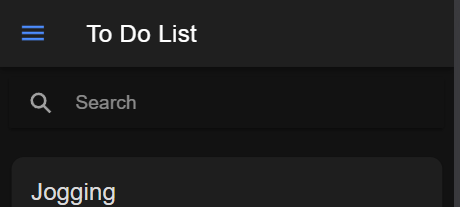
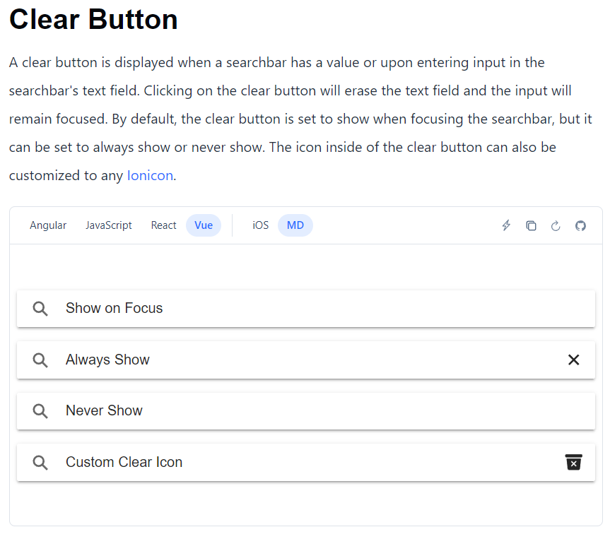
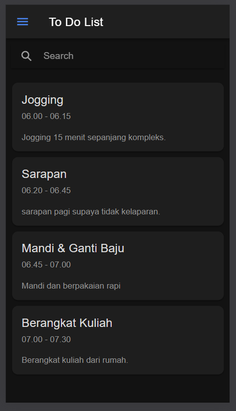
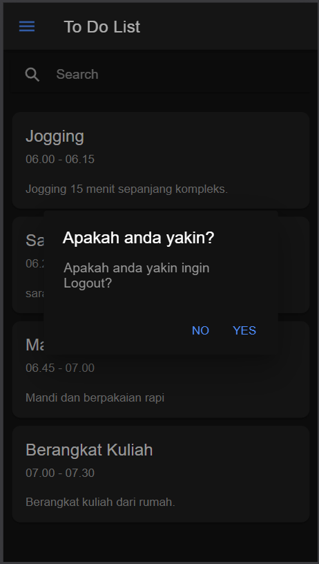

# LabMobile7_RassyaHafizhS_ShiftA

Nama    : Rassya Hafizh Suharjo

NIM     : H1D022068

Shift Baru : A

Shift Lama : D

## Penjelasan Komponen Ionic

Framework javascript yang digunakan adalah Vue
Template ionic yang digunakan sidemenu

Contoh komponen pada ionic tersedia di documentation ionic yang dapat diakses dengan mengklik link yang ada di starter template ionic. Programmer dapat mengambil contoh kode kemudian dimodifikasi sesuai kebutuhan.

Dalam vue, component harus diimport terlebih dahulu sebelum digunakan. Contoh pada 'ToDoListPage.vue'
```vue
<script setup lang="ts">
import { IonButtons, IonContent, IonHeader, IonMenuButton, IonPage, IonTitle, IonToolbar, IonSearchbar,
  IonCard, IonCardContent, IonCardHeader, IonCardSubtitle, IonCardTitle
 } from '@ionic/vue';
</script>
```

Component yang ditambahkan ke dalam kode ini :
 ### 1. Searchbar


Langkah - langkah :
Dalam halaman dokumentasi komponen ionic ke halaman searchbar kemudian pilih searchbar mana yang ingin digunakan setelah itu pilih vue.
Saya menggunakan searchbar dengan clear button. Terdapat kode untuk berbagai search bar dan pilih sesuai kebutuhan.


Dalam dokumentasi dicontohkan searchbar dalam berbagai jenis. Pilih sesuai kebutuhan untuk dimasukkan ke dalam kode yang dibuat. Di sini saya memilih yang resetbutton focus


Setelah mendapatkan kode yang dibutuhkan masukkan kode ke dalam kode yang dibuat dan modifikasi komponen sesuai kebutuhan
```vue
<div id="container">
        <ion-searchbar show-clear-button="focus"></ion-searchbar>
```

Lakukan import komponen 'Ionsearchbar' pada halaman tersebut dalam <script>
```vue
<script setup lang="ts">
import { IonButtons, IonContent, IonHeader, IonMenuButton, IonPage, IonTitle, IonToolbar, IonSearchbar} from '@ionic/vue';
</script>
```
selesai


 ### 2. Card


Caranya relatif sama dengan menambahkan komponen search dimana kita kali ini memilih komponen card pada dokumentasi di ionic dan menambahkan kodenya ke 'ToDoList.vue' sesuai kebutuhan
misal dari
```vue
<ion-card>
    <ion-card-header>
      <ion-card-title>Card Title</ion-card-title>
      <ion-card-subtitle>Card Subtitle</ion-card-subtitle>
    </ion-card-header>

    <ion-card-content>
      Here's a small text description for the card content. Nothing more, nothing less.
    </ion-card-content>
  </ion-card>
```
menjadi

```vue
<ion-card>
          <ion-card-header>
            <ion-card-title>Jogging</ion-card-title>
            <ion-card-subtitle>06.00 - 06.15</ion-card-subtitle>
          </ion-card-header>

          <ion-card-content>
            Jogging 15 menit sepanjang kompleks.
          </ion-card-content>
</ion-card>
```
Jangan lupa juga untuk menambah import komponen 'IonCard, IonCardContent, IonCardHeader, IonCardSubtitle, IonCardTitle'
```vue
<script setup lang="ts">
import { IonButtons, IonContent, IonHeader, IonMenuButton, IonPage, IonTitle, IonToolbar, IonSearchbar,
  IonCard, IonCardContent, IonCardHeader, IonCardSubtitle, IonCardTitle
 } from '@ionic/vue';
</script>
```


 ### 3. Sidemenu


Halaman sidemenu yang berada di 'App.vue' merupakan bawaan dari template sidemenu pada ionic apabila kita memilih sidemenu pada pembuatan starter template

Pada Sidemenu terdapat icon, cara menambahkan icon pada sidemenu yaitu dengan import icon
```vue
import {
  homeOutline,
  homeSharp,
  logOutSharp,
} from 'ionicons/icons';
```


 ### 4. Alert
 

 Caranya relatif sama dengan menambahkan komponen search dimana kita kali ini memilih komponen alert pada button alert pada dokumentasi di ionic dan menambahkan kodenya ke 'App.vue' sesuai kebutuhan. Komponen Alert akan muncul ketika menekan sidemenu logout.

Misal
```vue
<template>
  <ion-button id="present-alert">Click Me</ion-button>
  <ion-alert
    trigger="present-alert"
    header="Alert!"
    :buttons="alertButtons"
    @didDismiss="logResult($event)"
  ></ion-alert>
</template>

<script lang="ts" setup>
  import { IonAlert, IonButton } from '@ionic/vue';

  const alertButtons = [
    {
      text: 'Cancel',
      role: 'cancel',
      handler: () => {
        console.log('Alert canceled');
      },
    },
    {
      text: 'OK',
      role: 'confirm',
      handler: () => {
        console.log('Alert confirmed');
      },
    },
  ];

  const logResult = (ev: CustomEvent) => {
    console.log(`Dismissed with role: ${ev.detail.role}`);
  };
</script>
```

Menjadi

```vue
<script lang="ts" setup>
const showLogoutAlert = async () => {
  const alert = await alertController.create({
    header: 'Apakah anda yakin?',
    message: 'Apakah anda yakin ingin Logout?',
    buttons: [
      {
        text: 'No',
        role: 'cancel',
      },
      {
        text: 'Yes',
        handler: () => {
          console.log('Berhasil Log Out');
        },
      },
    ],
  });
  await alert.present();
};
</script>
```
Jangan lupa untuk menambahkan import untuk komponen 'alercontroller' dan 'ref'
```vue
import {
  IonApp,
  IonContent,
  IonIcon,
  IonItem,
  IonLabel,
  IonList,
  IonListHeader,
  IonMenu,
  IonMenuToggle,
  IonNote,
  IonRouterOutlet,
  IonSplitPane,
  alertController,
} from '@ionic/vue';
import { ref } from 'vue';
```